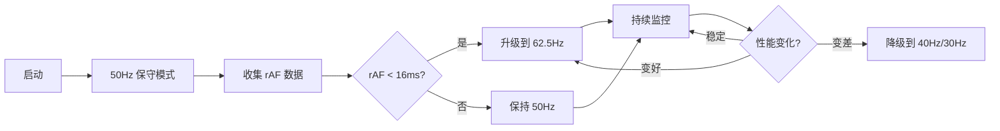

# 自适应步长 - 快速开始

## ⚠️ 重要提示

**自适应步长仅适用于单机游戏！** 

如果你在做**网络游戏**，请查看：[网游模式时间步长策略](./online-mode-timestep.md)

## 一句话总结

**启动时保守 50Hz，检测到稳定快速的 rAF 后自动升级到 62.5Hz** ✨

## 工作流程



## 代码已经集成完毕

你不需要做任何事情，系统会自动工作！

### 查看状态

浏览器控制台：

```javascript
// 查看当前配置
__adaptive__.get_debug_info()

// 输出示例:
{
  phase: 'calibrated',           // 已完成校准
  current: '高性能 (62.5Hz)',     // 当前档位
  step: 16,                      // 步长 16ms
  hz: 62.5,                      // 频率 62.5Hz
  raf: {
    avg: '8.23',                 // rAF 平均 8.23ms
    stability: '89.2%',          // 稳定性 89.2%
    samples: 120                 // 120 个样本
  },
  logic: {
    avg: '9.45',                 // 逻辑平均 9.45ms
    usage: '59.1%',              // 使用率 59.1%
    samples: 120
  }
}
```

## 典型场景

### 🖥️ 高性能 PC + 144Hz 显示器

```
0-2秒:  50Hz  (保守启动)
2-5秒:  50Hz  (收集数据)
5秒后:  62.5Hz ⬆️ (检测到快速稳定的 rAF)

结果: 充分利用高刷新率 ✨
```

### 💻 普通笔记本 + 60Hz 显示器

```
0-2秒:  50Hz  (保守启动)
2-5秒:  50Hz  (收集数据)
5秒后:  50Hz  (rAF ~17ms，匹配 50Hz)

结果: 保持稳定流畅 👍
```

### 📱 低端设备 / 后台运行

```
0-2秒:  50Hz  (保守启动)
2-5秒:  50Hz  (收集数据)
5秒后:  40Hz ⬇️ (rAF 慢或不稳定)

结果: 避免卡顿，平滑降级 ✅
```

## 调试技巧

### 查看实时步长

```javascript
// 每秒查询一次
setInterval(() => {
  console.log(`当前: ${__adaptive__.get_hz()}Hz`);
}, 1000);
```

### 模拟低端设备

```javascript
// 在游戏循环中添加延迟
function game_loop(timestamp) {
  // ... 原有代码
  
  // 模拟慢速逻辑 (15ms)
  const start = performance.now();
  while (performance.now() - start < 15) { /* busy wait */ }
  
  // ... 继续
}

// 结果: 系统会自动降频到 40Hz 或 30Hz
```

### 强制特定步长（仅用于测试）

如果你想临时禁用自适应，回到固定步长：

```typescript
// client/src/application/core/index.ts

// 注释掉这行
// const adaptive = new AdaptiveTimestep(true);

// 改为固定步长
const FIXED_STEP = 16; // 或 20, 25, 33
const adaptive = {
  get_step: () => FIXED_STEP,
  record_raf: () => {},
  record_logic: () => {},
  get_debug_info: () => ({ fixed: FIXED_STEP })
};
```

## 性能对比

### 固定 50Hz (旧方案)

```
120Hz 显示器: 未充分利用 ⚠️
60Hz 显示器:  完美 ✅
低端设备:     可能卡顿 ⚠️

评分: 7/10
```

### 固定 62.5Hz

```
120Hz 显示器: 完美 ✅
60Hz 显示器:  轻微抖动 ⚠️
低端设备:     可能严重卡顿 ❌

评分: 6/10
```

### 自适应 30-62.5Hz (新方案)

```
120Hz 显示器: 自动升级到 62.5Hz ✅
60Hz 显示器:  智能选择 50Hz ✅
低端设备:     自动降级到 40/30Hz ✅

评分: 10/10 ⭐
```

## 常见问题

### Q: 为什么启动时是 50Hz 而不是直接 62.5Hz？

A: 因为 rAF 不稳定，前几帧的数据不准确。保守启动可以：
- 避免误判（以为是高刷，实际是低刷）
- 防止初期卡顿（逻辑还在初始化）
- 给予校准时间（5秒后再做决策）

### Q: 能否更快地切换到最佳步长？

A: 可以，但不推荐。修改 `adaptive.ts`：

```typescript
private config = {
  sample_size: 60,          // 从 120 改为 60
  startup_duration: 1,      // 从 2 改为 1
  calibration_duration: 2,  // 从 5 改为 2
};

// 缺点：数据不够稳定，可能误判
```

### Q: 系统会频繁切换步长吗？

A: 不会。有 10 秒冷却期，避免频繁切换：

```typescript
adjustment_cooldown: 10  // 每次调整后 10 秒内不再调整
```

### Q: 如何知道系统是否工作正常？

A: 观察控制台输出（开发模式自动每 5 秒输出）：

```
📊 自适应步长状态: {...}
```

或者手动查询：

```javascript
__adaptive__.get_debug_info()
```

### Q: 我的游戏逻辑很简单，需要自适应吗？

A: 即使逻辑简单，rAF 的不稳定性仍然存在。自适应可以：
- 在高刷显示器上提供更好体验（62.5Hz）
- 在 rAF 波动时保持稳定（自动调整）
- 在后台运行时节省资源（降频）

推荐使用，开销几乎为零。

## 总结

自适应步长系统已经**开箱即用**：

1. ✅ **无需配置** - 自动工作
2. ✅ **智能调整** - 适应所有设备
3. ✅ **可观测** - 随时查看状态
4. ✅ **可调试** - 暴露所有信息
5. ✅ **可回退** - 需要时可禁用

享受自动优化的快感吧！🚀

